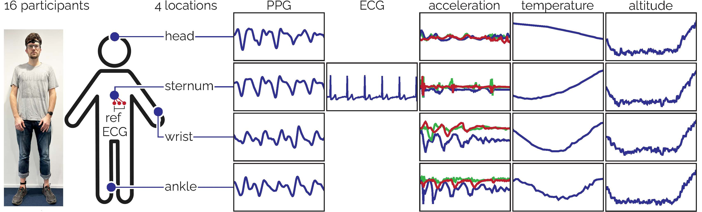
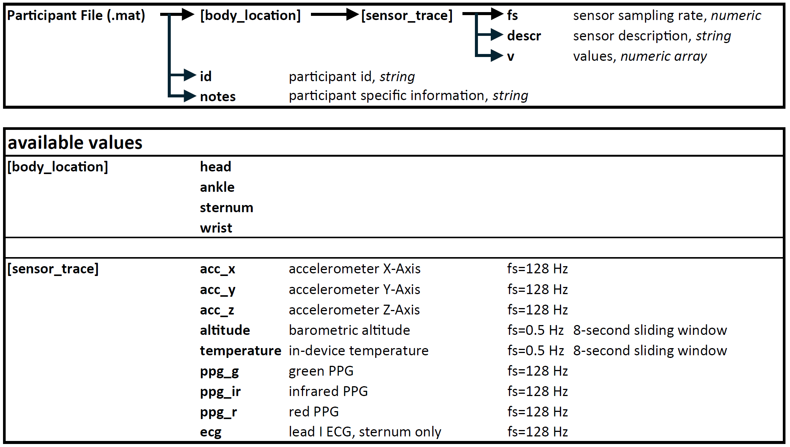

## [WildPPG](https://siplab.org/projects/WildPPG): A Real-World PPG Dataset of Long Continuous Recordings (NeurIPS 2024, Official Code)

[Manuel Meier](https://scholar.google.com/citations?user=L6f-xg0AAAAJ), [Berken Utku Demirel](https://scholar.google.com/citations?user=zbgxpdIAAAAJ), [Christian Holz](https://www.christianholz.net)<br/>

[Sensing, Interaction & Perception Lab](https://siplab.org), Department of Computer Science, ETH Zürich, Switzerland <br/>

<!--
___________
Quick Start

We have also provided the ground truth heart rate (cleaned version after Pan–Tompkins algorithm) while corresponding PPG and IMU segments for easy experimenting. The structured data is included in ... and the code to obtain data is in folder. 

-->

___________
Links: 
- [Project Website](https://siplab.org/projects/WildPPG)
- [Paper](https://static.siplab.org/papers/neurips2024-wildppg.pdf)
- [Dataset](https://polybox.ethz.ch/index.php/s/NWTuyNojU7aya1y)

----------


# Loading the Dataset
The dataset is available for download [here](https://polybox.ethz.ch/index.php/s/NWTuyNojU7aya1y)
The dataset is split into .mat matlab files representing participants and can be loaded with matlab.

## Loading the Data Using Python
The data can be loaded using [scipy.io.loadmat](https://docs.scipy.org/doc/scipy/reference/generated/scipy.io.loadmat.html). The function `load_wildppg_participant(path)` from `src/heuristic_baselines/ppg_beats_analyzer.py` can be used which cleans the loaded data and produces a nested dictionaries structure representing the same structure as the original .mat file.

## Dataset Structure


# Baseline Computation
For baseline computation, place all files of the dataset in a top-level `data` folder in this repository.
## Heuristic Baselines
1. Add repo to path in matlab.
2. Execute `src/heuristic_baselines/WildPPG_heuristic_baselines.m`. This will produce temporary processing files containing PPG beat locations computed by the various methods.
3. ```python src/heuristic_baselines/ppg_beats_analyzer.py```
This will compare the derived heart rates to ecg-based ground truth, produce a pandas dataframe with various resulting measures, export it as a .csv file, and print the main results. The measures will be computed for every combination of participant, body_location, and method and include: MAE, MAPE, correlation, RMSE, as well as a measure for the fraction of windows in which the method was unable to compute HR values.

## Supervised Baselines
1. Execute `python src/supervised_baselines/data_preprocessing.py`. This will produce a data file `WildPPG.mat` that serves as input-datafile for the supervised baslines

2. After the data is pre-processed and a input-datafile is available at `src/supervised_baselines/data_preprocess/data`, the command to run the supervised learning methods in `src/supervised_baselines`. Results are reported as print output.
```
python main_supervised_baseline.py --dataset 'alt' --backbone 'resnet' --block 8 --stride 2 --lr 5e-4 --batch_size 128 --n_epoch 999 --cuda 0
```

Citation
----------
If your find our dataset, paper or codes useful, please cite our work:

```
@inproceedings{meier2024wildppg,
  title={WildPPG: A Real-World PPG Dataset of Long Continuous Recordings},
  author={Meier, Manuel and Demirel, Berken Utku and Holz, Christian},
  booktitle={The Thirty-eight Conference on Neural Information Processing Systems Datasets and Benchmarks Track},
  year={2024},
}
```

License
---------

All data is released under CC BY-NC-SA 4.0 license (Creative Commons Attribution-NonCommercial-ShareAlike 4.0 International)

Code of WildPPG is licensed under GNU General Public License version 3 (GPL-3.0)

Note: Some of the code to compute benchmarks is released under different licenses, please consult the [license file](LICENSE.md) for more detailed information.


